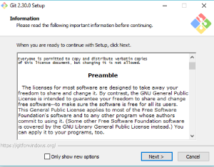
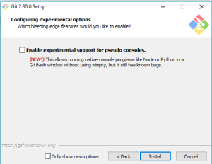
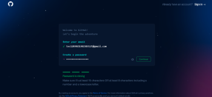
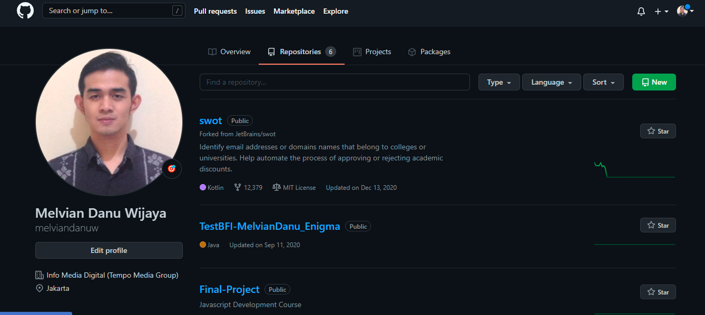

# <p align="center"> Version Control System
[](https://www.linkedin.com/in/melvian-wijaya-760b371b1/)
<p align="justify">Adalah sebuah kumpulan perangkat lunak yang sudah terintegrasi dan digunakan untuk membantu software engineer mengelola perubahan dalam source code dari waktu ke waktu. 

---
<br>


# GIT

<p align="justify">Merupakan alat pengontrol versi yangbertugas mencatat setiap perubahan pada file proyek yang dikerjakan oleh banyak orang maupun sendiri. Git dikenal juga dengan distributed revision control (VCS terdistribusi), artinya penyimpanan database Git tidak hanya berada dalam satu tempat saja.

---
<br>

# Instalasi GIT
1. Download GIT pada link berikut:
```sh
https://git-scm.com/downloads
```
2. Lakukan Instalasi



3. Cek Instalasi GIT melalui CMD/Bash dengan command berikut:
```sh
git --version
```

---
<br>

# Cara Membuat Akun Github
1. Masuk ke URL berikut:
```sh
https://github.com/
```
2. Klik Sign Up


3. Masukan Infomasi yang dibutuhkan untuk mendaftar.


4. Akun sudah berhasil dibuat.

---
<br>

# Command GIT
- *GIT CLONE*, berfungsi clone repository yang sudah ada dari git.
```sh
git clone <https://name-of-the-repository-link>
```
- *GIT CHECKOUT*, berfungsi untuk berpindah antar branch di git.
```sh
git checkout <name-of-your-branch>
```
- *GIT STATUS*, berfungsi untuk cek status infromasi yang ada di git.
```sh
git status
```
- *GIT ADD*, berfungsi untuk menambahkan file/folder di git sebelum di commit.
```sh
git add <file> //untuk menambahkan salah satu file/folder
git add . //untuk menambahkan semua file/folder
```
- *GIT COMMIT*, berfungsi commit file/folder yang telah ditambahkan pada ```git add```.
```sh
git commit -m "commit message"
```
- *GIT PUSH*, berfungsi push file/folder yang telah commit pada ```git commit```.
```sh
git push <remote> <branch>
```
- *GIT FETCH*, berfungsi menarik/pull update terakhir pada file/folder yang ada di repository git.
```sh
git commit -m "commit message"
```
- *GIT PULL*, berfungsi menarik/pull update terakhir pada file/folder yang ada di repository git dan merge dengan branch yang aktif.
```sh
git pull <remote>
```
- *GIT MERGE*, berfungsi menyatukan branch yang lain dengan branch yang sedang aktif.
```sh
git merge <branch>
```

---
<br>

# Cara Push GIT

1. Melakukan ```git init``` pada folder yang akan dipush.
```sh
git init
```
2. Menambahkan file/folder yang akan dipush, dengan command:
```sh
git add <fileName>
```
3. Melakukan Commit terhadap file/folder yang sudah ```git add```, dengan command:
```sh
git commit -m "Comment"
```
4. Pindah branch GIT dengan command:
```sh
git branch -M main
```
5. Tambahkan alamat repository dengan command:
```sh
git remote add origin <alamat repository>
```
6. Melakukan push dengan command:
```sh
git push -u origin main
```

---
<br>

# FAQ

Q: Apabila terjadi error:
```sh
! [rejected]        main -> main (fetch first)
error: failed to push some refs to 'https://github.com/namaAkun/namaRepo.git'
```
A: Lakukan ```git pull``` pada repository, dengan command:

```sh
git pull origin main --allow-unrelated-histories
```
---

Q: Apabila terjadi error:
```sh
error: src refspec main does not match any
```
A: Pastikan sudah Commit git yang telah ditambahkan, dengan command:
```sh
git commit -m "intial commit"
```
A: Pastikan sudah pindah branch, dengan command:
```sh
git branch -M <branch>
```